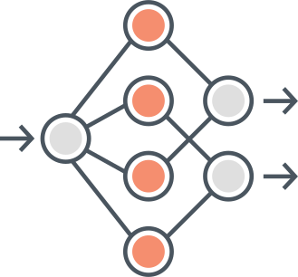

# Red neuronal en Python

  

## Contributor

## Tabla de contenido

- [Red neuronal en Python](#red-neuronal-en-python)
  - [Contributor](#contributor)
  - [Descripción](#descripción)
  - [La neurona artificial:](#la-neurona-artificial)
  - [Funciones de activación](#funciones-de-activación)
      - [Función escalon:](#función-escalon)
      - [Función Sigmoide:](#función-sigmoide)
      - [Función tangente hiperbólica:](#función-tangente-hiperbólica)
      - [Función relu:](#función-relu)
  - [Forward pass:](#forward-pass)
  - [Función de coste](#función-de-coste)
  - [Back Propagation](#back-propagation)
      - [Delta de la ultima capa](#delta-de-la-ultima-capa)
    - [Delta en capas intermedias](#delta-en-capas-intermedias)
  - [Descenso del gradiente](#descenso-del-gradiente)
  - [Licencia](#licencia)
    - [GNU General Public License](#gnu-general-public-license)

## Descripción

El siguiente documento describe la forma en que opera una red neuronal en su forma más simplificada. La idea es llegar a la comprensión de sus ecuaciones matemáticas como también arribar a una comprensión de los algoritmos que intervienen en este tipo de tecnología que actualmente esta revolucionando el campo de la información.

El documento pretende esclarecer y documentar el codigo que se haya dentro de la carpeta `code`

En primera instancia se explica lo que es una neurona artificial sus ecuaciones matemáticas y cómo es la formulación matemática de la misma.

Siguiendo el camino iniciado lo que sigue es la implementación de los tres algoritmos que intervienen en el aprendizaje de una red neuronal artificial esos algoritmos son el `forward pass`, el `back propagation` y el `gradiente descenso`.

Se documenta de forma sencilla, explicando paso a paso cómo se hace el aprendizaje de esta red y cómo va ajustando sus pesos para llegar a minimizar el error.

## La neurona artificial:

La neurona  es una unidad de cálculo que intenta emular el modelo de comportamiento de una neurona “natural”, similares a las que constituyen del cerebro  humano. A partir de la interconexión de cada unidad esencial se  construye una red neuronal artificial.

Éste elemento de cálculo elemental (neurona modelo) a menudo se denomina nodo o unidad. Recibe información de algunas otras unidades, o quizás de una fuente externa. Cada entrada tiene un peso correspondiente w, que se puede cambiar para modelar el aprendizaje sináptico.

Podemos ver en el gráfico, que la **neurona** no es más que el nombre que asume la suma ponderada entre las entradas *F(x1w1 + x2w2 +....+ xnwn + b)*, es decir que un conjunto de entradas representadas por las *equis* se multiplica por las *doble v* y a eso se le suma un termino independiente y luego se le aplica una función de activación.

Por lo tanto podemos definir  a la neurona como la siguiente:
$$
A\Big(\sum_{i=1}^{n} x_iw_i + b\Big)
$$

Donde "A" es una función de activación. Mas abajo se detallan las funciones de activación, ahora lo que nos interesa ver es que las operaciones en una neurona se pueden representar de forma verctorial, veamos  esto: Suponemos que `X` es un vector de entradas, mientras `W` un vector de pesos de la misma dimensión y `b` un escalar, podemos representar la actividad de la **neurona** como sigue:
$$
A\Big[(\vectorarrow X \vdot \vectorarrow W)\Big]+b
$$

## Funciones de activación

Luego de hacer el producto punto o producto vectorial entre ambos vectores, el de los pesos y el de las entradas, obtenemos un escalar, *b* tambien es un escalar por lo tanto la suma de dos escalares es otro número escalar. Por lo tanto, la función de activación recibe como entrada a dicho escalar. La función de activación sirve para concatenar muchas neuronas y que el resultado no sea siempre una función lineal. A continuacion se detallan las funciones de activacion mas importantes.

#### Función escalon:

$$
F(z) = \left\{ \begin{array}{lcc}
             0 &   si  & z < 0 \\
             \\ 1 &  si & z \geq 0 \\
             \end{array}
   \right.
$$

#### Función Sigmoide:

$$
  Función Sigmoide:\\
   G(z)=\frac{1}{1+e^{-z}}
$$

#### Función tangente hiperbólica:

$$
 H(z)=\frac{e^z - e^{-z}}{e^z + e^{-z}}
$$

#### Función relu:

$$
K(z) = max(0,z)
$$

## Forward pass:

Como se puede ver en la imagen, las neuronas se encadenan unas con otrasy que las salidas de todas las neuronas de una capa constituye el vector de entrada de todas las neuronas de la capa siguiente. Tieniendo esto en mente, podemos definir una capa en una red neuronal, como una matriz de pesos `W` donde cada uno de los vectores de dicha matriz constituye el vector de pesos de cada neurona. Por lo tanto una capa tendra una matriz **m** x **n** donde **m** es el número de filas que tendra la misma longitud al vector de las **x** y **n** constituye el numero de neuronas de la capa. No olvidemos además que tenemos el término independiente, en este caso es un vector de longitud **n** es decir un **b** por cada neurona.

Por lo tanto el **forward pass** no es mas que el producto matricial entre el vector **X** por la matriz **m** x **n** con X=m y n=b y asi iterando por cada una de las capas hasta llegar a la capa de salida.

## Función de coste

Para el coste se utiliza el error cuadratico medio. Esta función determina que tan lejos esta la salida del valor esperado. Durante el entrenamiento de la red, el error constituye el punto de partida del aprendizaje de la misma, ya que todo el algoritmo intenta que este error sea el minimo posible.
$$
\bar E^2=\frac{\sum_{i=1}^{n} (y-y0)^2}{n}
$$

## Back Propagation

Teniendo el error calculado, procedemos ahora a calcular el **Delta**. ¿Que es el delta?. El delta es cuanto varia el resultado en función de cada neurona.

Aca es importante destacar que por regla de la cadena, la derivada de una capa intermedia, es siempre su derivada multiplicada por la derivada de las capas siguiente, por eso salvo la ultima capa, el resto de las capas calculan su delta a partir de las deltas calculadas anteriormente.

#### Delta de la ultima capa

C = Coste

A = Activación
$$
\begin{align*}
\Delta = \frac{\partial C}{\partial A}.\frac{\partial A^l}{\partial Z^l} \\ \\
\Delta = \partial C(a^l - y).\partial A(a^l)
\end{align*}
$$

### Delta en capas intermedias

a = vector de activación de la capa

w = vector de pesos de una capa
$$
\begin{align*}
\Delta = \Delta^{l+1}.(w^{l+1})^T.\partial A(a^l)
\end{align*}
$$

## Descenso del gradiente

El descenso del gradiente nos viene a indicar como basados en los deltas, vamos actualizando los vectores de pesos y bias de cada una de las capas.

Esto lo vamos haciendo al mismo paso que vamos obteniendo los deltas, tambien vamos actualizando los pesos.
$$
\begin{align*}
b = b - \frac{1}{n}\sum_{i=1}^{n}\Delta .lr \\ \\
w = w - \Big [(a^l)^T . \Delta^l \Big].lr
 
\end{align*}
$$

Este proceso de ir hacia de adelante y luego hacia atras una y otra vez con la intención de disminuir el error es lo que se denomina **epoch** y contituye las iteraciones de los set de datos con el fin de disminuir el error al minimo posible con lo que habremos conseguido que la red aprenda.

## Licencia

Copyright (C) 2021.

- Héctor Orlando,
  -   

### GNU General Public License

Este programa es software gratuito: puedes redistribuirlo y/o modificar bajo los términos de la Licencia Pública General GNU tal como se publicó por la Free Software Foundation, ya sea la versión 3 de la Licencia, o cualquier versión posterior.

Este programa se distribuye con la esperanza de que sea de utilidad, pero SIN NINGUNA GARANTÍA; sin siquiera la garantía implícita de COMERCIABILIDAD o APTITUD PARA UN PROPÓSITO PARTICULAR. Ver el Licencia pública general GNU para más detalles.

Debería haber recibido una copia de la Licencia Pública General GNU junto con este programa, en [LICENSE.md](http://license.md/) o https://www.gnu.org/licenses/gpl-3.0.html.en.